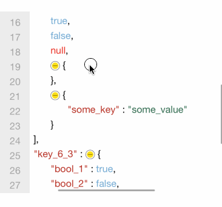
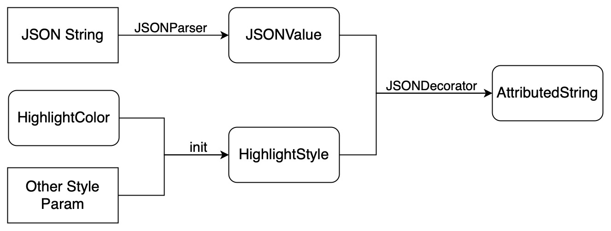

<p align="center">

</p>

<p align="center">
<a href="https://swiftpackageindex.com/RakuyoKit/JSONPreview"></a>
<a href="https://swiftpackageindex.com/RakuyoKit/JSONPreview"></a>
<a href="https://cocoapods.org/pods/JSONPreview"></a>
<a href="https://raw.githubusercontent.com/RakuyoKit/JSONPreview/master/LICENSE"></a>
</p>

`JSONPreview` is a JSON preview component that allows you to **format** your JSON data and display it with **syntax highlighting**. Additionally, `JSONPreview` offers **fold and expand** functionality, allowing you to collapse nodes you're not currently focusing on and re-display them at any time.

`JSONPreview` inherits from `UIView` and implements related features based on `UITextView`. The entire framework is entirely implemented based on native frameworks, which means when using this framework on Apple platforms, you can achieve a better user experience.

## Preview

Below is a roughly 25-second gif (**approximately 2.5M**) demonstrating the effect of previewing JSON using this library.



## Requirements

- **iOS 12 or later**.
- **Xcode 10.0 or later** required.
- **Swift 5.0 or later** required.

## Installation

### CocoaPods

```ruby
pod 'JSONPreview'
```

### Swift Package Manager

- Select File > Swift Packages > Add Package Dependency
- Add https://github.com/RakuyoKit/JSONPreview.git
- Select "Up to Next Major" with "2.2.3"

Or add the following content to your `Package.swift` file:

```swift
dependencies: [
  .package(url: "https://github.com/RakuyoKit/JSONPreview.git", from: "2.2.3")
]
```

## Features

- [x] Support for **formatting** JSON data.
- [x] Support for syntax **highlighting** of JSON data, offering various color and font configuration options.
- [x] **fold and expand** functionality for `Array` and `Object`.
- [x] Allow setting the initial state of nodes, `.folded` or `.expand`.
- [x] Implemented based on `UITextView`. This means you can copy any content from `JSONPreview`.

> Additional Details:
> 1. `JSONPreview` provides limited and incomplete formatting checks, so this feature is not offered as a primary function. Details can be found in: [Format check](#format-check).
> 2. Version [1.2.0](https://github.com/RakuyoKit/JSONPreview/releases/tag/1.2.0) added support for rendering links. Alongside rendering, `JSONPreview` performs limited unescaping: supporting replacing `"\\/"` with `"/"`.

## Usage

> After downloading the project, [`EntranceTableViewController.swift`](Demo/JSONPreviewDemo/Example/EntranceTableViewController.swift) contains some example code. Run the project to see the corresponding effect.

### Basic Usage and Default Configuration

1. Create a `JSONPreview` object and add it to the interface:

```swift
let previewView = JSONPreview()
view.addSubview(previewView)
```

2. Call the `JSONPreview.preview` method to preview the data with the default style:

```swift
let json = "{\"key\":\"value\"}"
previewView.preview(json)
```

### Custom Styles

If you want to customize the syntax highlighting style, you can set it using `HighlightStyle` and `HighlightColor`:

> [`ConvertibleToColor`](Sources/Entity/HighlightColor.swift#L117) is a protocol for providing colors. Through this protocol, you can directly use `UIColor` objects or easily convert values like `0xffffff`, `#FF7F20` and `[0.72, 0.18, 0.13]` into `UIColor` objects.

```swift
let highlightColor = HighlightColor(
    keyWord: ConvertibleToColor,
    key: ConvertibleToColor,
    link: ConvertibleToColor,
    string: ConvertibleToColor,
    number: ConvertibleToColor,
    boolean: ConvertibleToColor,
    null: ConvertibleToColor,
    unknownText: ConvertibleToColor,
    unknownBackground: ConvertibleToColor,
    jsonBackground: ConvertibleToColor,
    lineBackground: ConvertibleToColor,
    lineText: ConvertibleToColor
)

let style = HighlightStyle(
    expandIcon: UIImage?,
    foldIcon: UIImage?,
    color: highlightColor,
    lineFont: UIFont?,
    jsonFont: UIFont?,
    lineHeight: CGFloat
)

previewView.preview(json, style: style)
```

You can also configure the `initialState` parameter to set the initial state of JSON child nodes.

```swift
// By default, all nodes are initially in a collapsed state during preview.
previewView.preview(json, style: style, initialState: .folded)
```

## Format Check

When rendering JSON, `JSONPreview` performs **limited** formatting checks.

Known conditions that trigger "error rendering" include:

- Values of unconventional JSON types. Supported types are `object`, `array`, `number`, `bool`, `string`, and `null`.
- Checking for formatting in `number`, such as scientific notation and decimals.
- Spelling check for `true`, `false`, and `null`.
- For scientific notation, the next node after `{E/e}` must be `+`, `-`, or a digit.
- Missing `,` separators between elements in an `array`.
- Missing `,` separators between elements in an `object`.
- No `:` after a key in an `object`.
- `object` has `:` after a key but lacks a value.
- Keys in `object` are not strings.

Apart from the explicitly mentioned conditions, other errors might trigger "error rendering". Additionally, there could be some errors outside the scope of formatting checks that might **result in missing content** in the JSON.

It's recommended not to overly rely on the formatting check feature of `JSONPreview` and to use it for previewing correctly formatted JSON as much as possible.

## Data Flow Diagram



## TODO

- [ ] Support for intel macOS.

## Thanks

Thanks to [Awhisper](https://github.com/Awhisper) for valuable insights during the development of `JSONPreview`.

## License

`JSONPreview` is available under the **MIT** license. For more information, see [LICENSE](LICENSE).
